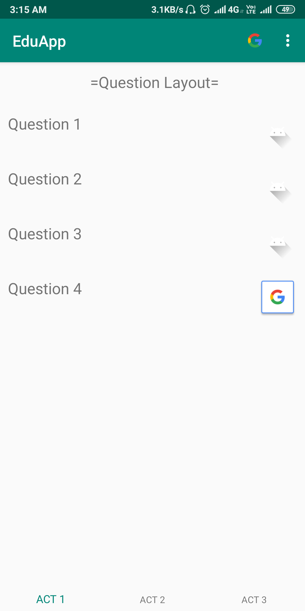
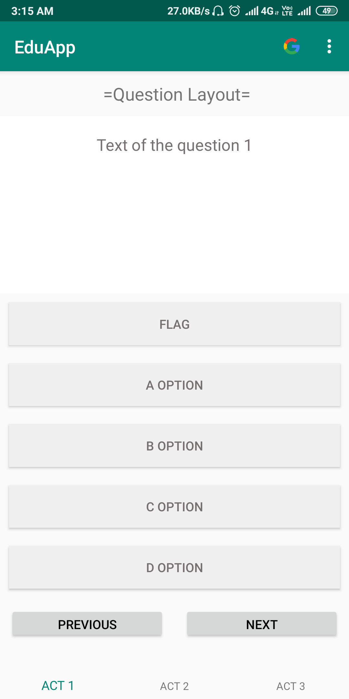
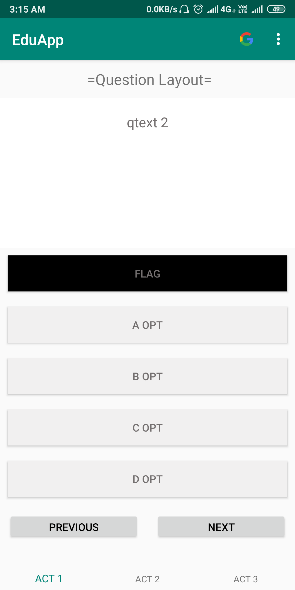
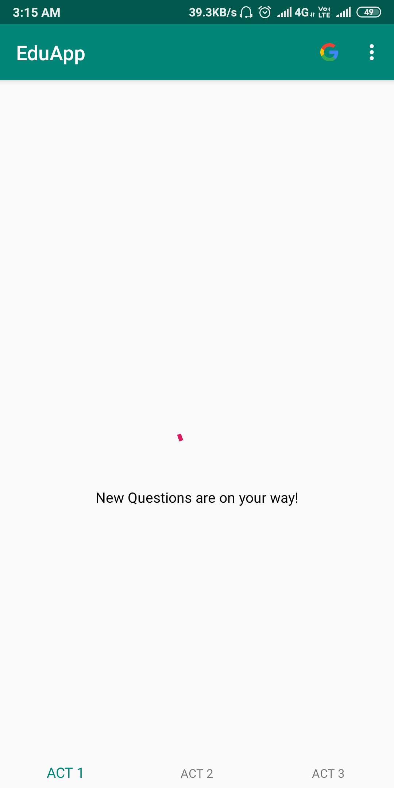

# Edu_App
This is a firebase backend quiz based application with an android front interface.

## Screenshots

##### It displays the question layout which tells us which questions are marked and which are not answered.

##### It shows the  way to select an answer, flag it and even jump back to previous answer or go to the next one. From here we can also access the question layout screen.

##### It shows the screen where a particular aiso question has been flagged and kept for later answering.

##### It shows the loading screen of the test. 

